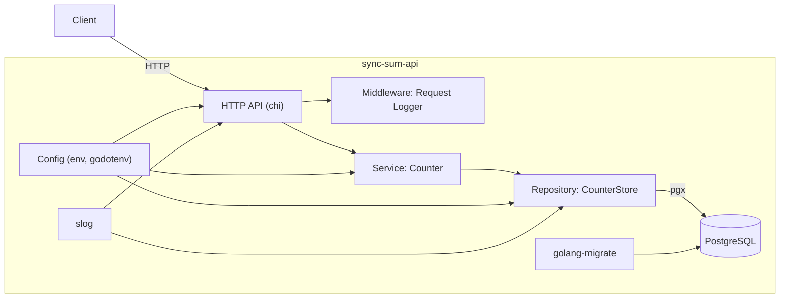

# sync-sum-api

Сервис-счетчик с REST API и атомарным инкрементом на PostgreSQL. Реализованы принципы SOLID, изоляция слоев (HTTP → Service → Repository), миграции БД, логирование и e2e тесты.

## Возможности
- POST `/counter/increment` — атомарно увеличить счетчик на 1, вернуть новое значение
- GET `/counter` — получить текущее значение

## Архитектура



## Требования
- Go 1.24+
- Docker (для локальной БД и e2e тестов)

## Конфигурация
Значения берутся из переменных окружения. Для локального запуска поддерживаются `.env` и `.env.local`.

Основные переменные:
- HTTP_PORT (default: 8080)
- DB_HOST (default: localhost)
- DB_PORT (default: 5432)
- DB_USER (default: postgres)
- DB_PASSWORD (default: postgres)
- DB_NAME (default: syncsum)
- DB_SSLMODE (default: disable)
- MIGRATIONS_DIR (default: migrations)
- MIGRATIONS_VERSION (0 — до последней)

## Команды

### Запуск приложения

1. **Поднять PostgreSQL:**
```bash
docker compose up -d postgres
```

2. **Применить миграции:**
```bash
go run ./cmd/migrate
```

3. **Запустить сервер:**
```bash
go run ./cmd/server
```

### Миграции

**Накат миграций (до последней версии):**
```bash
go run ./cmd/migrate
```

**Накат до конкретной версии:**
```bash
MIGRATIONS_VERSION=1 go run ./cmd/migrate
```

**Откат миграций:**
```bash
# Откат до версии 0 (удаление всех миграций)
MIGRATIONS_VERSION=0 go run ./cmd/migrate
```

### Тестирование

**Запуск e2e тестов:**
```bash
go test ./test -v
```

**Запуск всех тестов:**
```bash
go test ./...
```

**Запуск тестов с покрытием:**
```bash
go test -cover ./...
```

### Разработка

**Обновить зависимости:**
```bash
go mod tidy
```

**Собрать приложение:**
```bash
go build ./cmd/server
go build ./cmd/migrate
```

## Примеры запросов

**Инкремент счетчика:**
```bash
curl -X POST http://localhost:8080/counter/increment
```

**Получить значение:**
```bash
curl http://localhost:8080/counter
```

**OpenAPI спецификация:**
```bash
curl http://localhost:8080/api/doc
```

## Логирование
- `slog` в формате JSON, уровни Info/Debug
- Логируются все HTTP-запросы (middleware), операции API, взаимодействия с Postgres
- Ошибки логируются на границах (API/entrypoints)
- Промежуточные слои оборачивают ошибки (`github.com/pkg/errors`) и пробрасывают наверх

## Структура проекта
- `cmd/server` — запуск HTTP сервера
- `cmd/migrate` — мигратор (env-only)
- `internal/httpapi` — роутинг, хендлеры, middleware
- `internal/service` — бизнес-логика (Counter)
- `internal/repository` — работа с БД (pgx), транзакции, блокировки
- `migrations` — SQL миграции
- `api/openapi.yaml` — OpenAPI спецификация
- `test/e2e_test.go` — e2e тесты

## Безопасность инкрементов
Используется транзакция и `SELECT ... FOR UPDATE` для блокировки строки счетчика, предотвращая потерю обновлений при конкурентных запросах и в многократных инстансах.

## Лицензия
MIT
